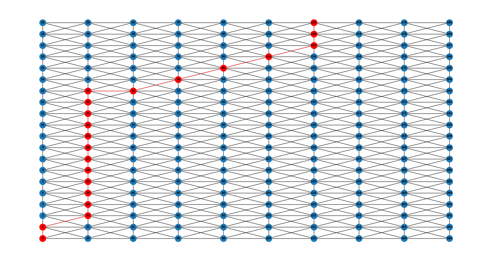
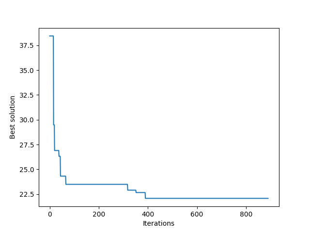

# Ant Colony Optimization with Time Windows 

An implementation of Ant Colony Optimization algorithm for path finding in a scenario where more Automated Guided Vehicles (AGV) share the same paths.

The considered scenario force the ACO to consider time windows in which paths and positions of interest are free or occupied by other vehicles.

