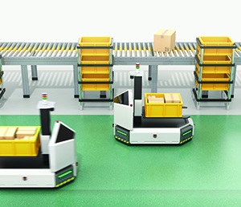

# Ant Colony Optimization with Time Windows 

Most of algorithms for tasks assignment, routing, or path finding presented in scientifi literature do not consider important aspects such as possible robot-robot or human-robot collisions considering agents that share the same environment.

This repository presents an implementation of Ant Colony Optimization algorithm for path finding in a scenario where more Automated Guided Vehicles (AGV) share the same paths. The considered scenario force the ACO to consider time windows in which paths and positions of interest are free or occupied by other vehicles.

